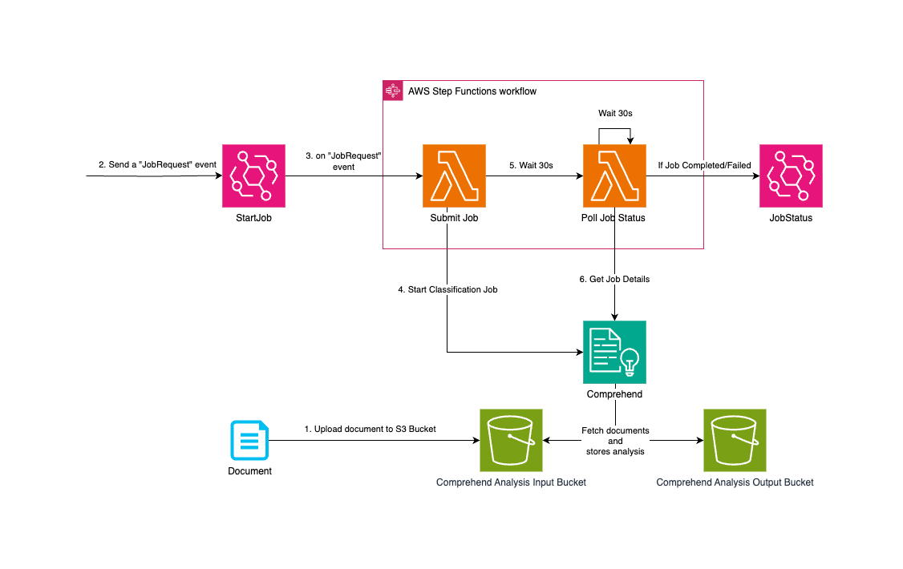
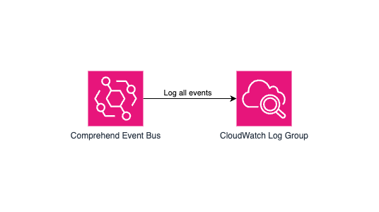

# Asynchronous Comprehend
This is a CDK project that demonstrates two options to to use Comprehend's Job based SDKs with AWS events.

## Polling

  

In order to log events, the logger stack also deploys this.

## S3 Events

  

## Useful commands
 * `cdk synth`       emits the synthesized CloudFormation template
 * `cdk deploy`      deploy this stack to your default AWS account/region
 * `cdk destroy`     destroy this stack and remove resources from your AWS account

## License

This library is licensed under the [MIT-0](https://github.com/aws/mit-0) license. For more details, please see [LICENSE](LICENSE) file

## Legal disclaimer

Sample code, software libraries, command line tools, proofs of concept, templates, or other related technology are provided as AWS Content or Third-Party Content under the AWS Customer Agreement, or the relevant written agreement between you and AWS (whichever applies). You should not use this AWS Content or Third-Party Content in your production accounts, or on production or other critical data. You are responsible for testing, securing, and optimizing the AWS Content or Third-Party Content, such as sample code, as appropriate for production grade use based on your specific quality control practices and standards. Deploying AWS Content or Third-Party Content may incur AWS charges for creating or using AWS chargeable resources, such as running Amazon EC2 instances or using Amazon S3 storage.

